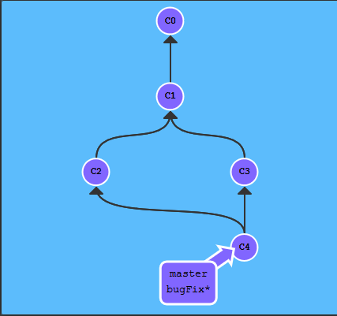

**GitFlow Explaination and Commands**

What is *gitFlow*?
gitFlow is a Git workflow diagram/design that defines branching in a form of a digital model. It provides a way of seeing the path of changes to the project and helps with managing them as well. 

For Example of how gitFlow workflow Diagram might look like reference the following photo:

 

While the workflow diagram doesn't add additional concepts or commands it instead utilizes git commands, but it assigns roles to the different branches that are availible in the project. 

Think of gitflow as a way of looking at the work of a project from a overhead point of view in detail laid before you. Whenever you make a change or merge, it will illustrate the work right before. This is a great way to indentify and coordinate with other collaborators bringing everyone on to the same page. 

There are a few terms and commands everyone should know if they truly want to utilize git.
You can find those commands and examples here: [Git Commands](/gitcommands.md)

